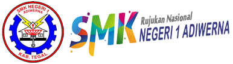

# Website Resmi ADB Creative Team



Selamat datang di repositori resmi untuk website ADB Creative Team. Proyek ini dibangun menggunakan Next.js, TypeScript, dan Tailwind CSS, berfungsi sebagai platform utama untuk menampilkan informasi, portofolio, artikel, dan detail mengenai berbagai divisi dalam tim.

## ✨ Fitur Utama

- **Desain Responsif**: Tampilan yang optimal di berbagai perangkat, dari desktop hingga mobile.
- **Halaman Dinamis**: Konten untuk artikel dan detail divisi dibuat secara dinamis.
- **Struktur Modern**: Menggunakan App Router dari Next.js 13+ untuk routing dan layout.
- **Styling Modern**: Dibuat dengan Tailwind CSS untuk pengembangan UI yang cepat dan konsisten.

## 🛠️ Teknologi yang Digunakan

- **Framework**: [Next.js](https://nextjs.org/)
- **Bahasa**: [TypeScript](https://www.typescriptlang.org/)
- **Styling**: [Tailwind CSS](https://tailwindcss.com/)
- **Linting**: ESLint
- **Package Manager**: npm

## 🚀 Instalasi dan Menjalankan Proyek

Untuk menjalankan proyek ini di lingkungan lokal Anda, ikuti langkah-langkah berikut:

**1. Clone Repositori**

```bash
git clone https://github.com/username/adbcreativeteam.git
cd adbcreativeteam
```

**2. Instal Dependensi**

Proyek ini menggunakan `npm` sebagai package manager.

```bash
npm install
```

**3. Jalankan Server Development**

Setelah instalasi selesai, jalankan server development:

```bash
npm run dev
```

Buka [http://localhost:3000](http://localhost:3000) di browser Anda untuk melihat hasilnya.

## 📜 Skrip yang Tersedia

Dalam file `package.json`, terdapat beberapa skrip yang bisa digunakan:

- `npm run dev`: Menjalankan aplikasi dalam mode development.
- `npm run build`: Membuat build aplikasi untuk production.
- `npm run start`: Menjalankan aplikasi dari build production.
- `npm run lint`: Menjalankan linter untuk memeriksa kualitas kode.

## 📁 Struktur Proyek

Berikut adalah gambaran umum struktur direktori dan file penting dalam proyek ini:

```
adbcreativeteam/
├── public/              # Aset statis (gambar, logo, font)
├── src/
│   ├── app/             # Direktori utama untuk App Router Next.js
│   │   ├── (pages)/     # Grup rute untuk halaman utama
│   │   │   ├── artikel/
│   │   │   ├── divisi/
│   │   │   ├── galeri/
│   │   │   └── kontak/
│   │   ├── globals.css  # CSS global
│   │   ├── layout.tsx   # Layout utama aplikasi
│   │   └── page.tsx     # Halaman utama (Homepage)
│   └── components/      # Komponen React yang dapat digunakan kembali
├── next.config.js       # Konfigurasi Next.js
├── tailwind.config.ts   # Konfigurasi Tailwind CSS
└── tsconfig.json        # Konfigurasi TypeScript
```

## 📄 Struktur Halaman (Routing)

Aplikasi ini menggunakan App Router dari Next.js. Berikut adalah daftar rute utama yang tersedia:

- **`/`**: Halaman Utama (Homepage)
- **`/artikel`**: Menampilkan daftar semua artikel atau blog.
- **`/artikel/[slug]`**: Menampilkan halaman detail untuk satu artikel.
- **`/divisi`**: Halaman pengenalan untuk semua divisi yang ada.
- **`/divisi/[nama-divisi]`**: Halaman detail untuk divisi spesifik (contoh: `/divisi/desain`).
  - **`/divisi/[nama-divisi]/informasi`**: Halaman informasi tambahan mengenai divisi tersebut.
  - **`/divisi/[nama-divisi]/[slug]`**: Halaman detail portofolio atau anggota dari divisi tersebut.
- **`/divisi/join`**: Halaman untuk bergabung dengan tim.
- **`/galeri`**: Galeri foto atau video kegiatan tim.
- **`/kontak`**: Halaman kontak untuk menghubungi tim.

## 🤝 Kontribusi

Kontribusi sangat kami harapkan! Jika Anda ingin berkontribusi, silakan ikuti langkah-langkah berikut:

1.  **Fork** repositori ini.
2.  Buat **branch** baru untuk fitur Anda (`git checkout -b fitur/NamaFitur`).
3.  **Commit** perubahan Anda (`git commit -m 'Menambahkan fitur X'`).
4.  **Push** ke branch Anda (`git push origin fitur/NamaFitur`).
5.  Buka **Pull Request**.

## 📝 Lisensi

Proyek ini dilisensikan di bawah [MIT License](LICENSE.md).
